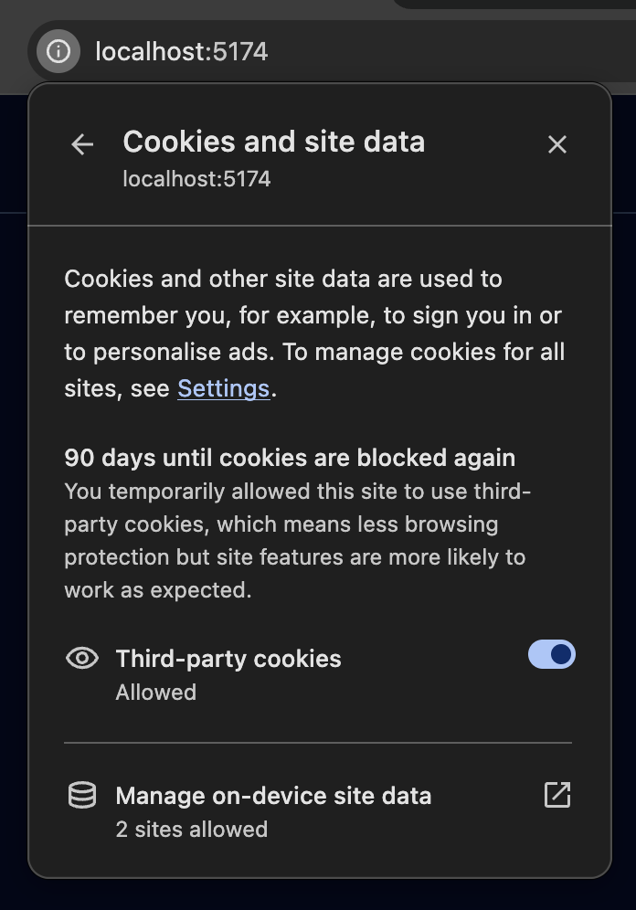

# Auth0




Resent platform changes of Auth0 have made it hard for us to recomend Auth0 in good consience. \
See: [https://community.auth0.com/t/silent-authentication-systematically-requiring-consent-in-spa-breaking-token-rotation-for-oidc-spa-library-users/201575](https://community.auth0.com/t/silent-authentication-systematically-requiring-consent-in-spa-breaking-token-rotation-for-oidc-spa-library-users/201575)


## Configuring a Custom Domain

First step is to configure a custom Domain.

1. Navigate to the [Auth0 Dashboard](https://manage.auth0.com/dashboard).
2. Click **Settings** in the left panel.
3. Open the **Custom Domain** tab.
4. Configure a custom domain (e.g., `auth.my-company.com`). Make sure it's a sub domain of where your app will be deployed. &#x20;
5. Copy this (`auth.my-company.com`) it is your `issuerUri`.

<figure><figcaption><p>In this screenshot we used auth0.oidc-spa.dev (instead of auth.my-company.com)</p></figcaption></figure>

## Declaring Your Application

1. Navigate to [Auth0 Dashboard](https://manage.auth0.com/dashboard).
2. In the left panel, go to **Applications → Applications**.
3. Click **Create Application**.
4. Select **Single Page Application** as the application type.
5. Scroll to the Application URIs section. Set two **Allowed Callback URLs**:
   * `https://my-app.my-company.com/` (include trailing slash; adjust if hosted under a subpath, e.g., `https://my-company.com/my-app/`)
   * `http://localhost:5173/` (include trailing slash; adjust based on your dev server)
6. **Allowed Logout URLs**: Copy paste what you put into **Allowed Callback URLs**
7. **Allowed Web Origins:** The origins of the Callback URLs
8. Click **Save Changes**
9. Copy the **Client ID**

<figure><figcaption></figcaption></figure>

<figure><figcaption></figcaption></figure>

## Creating an API

If you need Auth0 to issue a JWT access token for your API, follow these steps:

1. Navigate to [Auth0 Dashboard](https://manage.auth0.com/dashboard).
2. In the left panel, go to **Applications → APIs**.
3. Click **Create API**.
4. Navigate to the Settings tab
5. Fill up **Identifier**: Ideally, use your API's root URL (e.g., `https://myapp.my-company.com/api`). However, this is just an identifier, so any unique string works. Copy it, it is your audience (aud claim in the access token's JWT)
6. Under **Access Token Settings: We want to reduce the lifespan of the access token, the 24 hour default is non acceptable for an SPA usecase.**
   * **Maximum Access Token Lifetime**: `5 minutes` (300 seconds), can be even shorter. It only need to be valid for the duration of transit from the frontend to the backend. &#x20;
   * **Implicit/Hybrid Flow Access Token Lifetime**: `5 minutes` – required to save settings, even if unused.
7. Click **Save**

<figure><figcaption></figcaption></figure>

## (Optional) Configuring Auto Logout

If you want users to be [**automatically logged out**](../features/auto-logout.md) after a period of inactivity, follow these steps.

### When and Why Enable Auto Logout?

For **security-critical applications** like banking or admin dasboards users should:

* Log in **on every visit**.
* Be **logged out after inactivity**.

This prevents unauthorized access if a user steps away from their device.

For apps like social media or e-comerce shop on the other hand it's best **not** to enable auto logout.

### Configuring Session Expiration in Auth0

1. Navigate to [Auth0 Dashboard](https://manage.auth0.com/dashboard).
2. Click **Settings** in the left panel.
3. Open the **Advanced** tab.
4. Configure **Session Expiration**:
   * **Idle Session Lifetime**: `30 minutes` (1800 seconds) – logs out inactive users. Copy the value in seconds this will be your `idleSessionLifetimeInSeconds`.
   * **Maximum Session Lifetime**: `14 days` (20160 minutes) – ensures active users stay logged in.

Since Auth0 **does not issue refresh tokens** (or issues non-JWT ones), inform `oidc-spa` of your settings:

## Providing the Parameters to oidc-spa




```typescript
createOidc({
    issuerUri: "auth.my-company.com",
    clientId: "DzXSmwQS7oSTQGLbafhrPXYLT0mOMyZD"
    extraQueryParams: {
       audience: "https://app.my-company.com/api"
    }
    // (Optional) This must be kept in sync with the Idle Session Lifetime value 
    // configured in the Auth0 dashboard. To ensure correct autoLogout behavior.
    idleSessionLifetimeInSeconds: 1800,
    // ...
});
```





```typescript
bootstrapOidc({
    issuerUri: "auth.my-company.com",
    clientId: "DzXSmwQS7oSTQGLbafhrPXYLT0mOMyZD"
    extraQueryParams: {
       audience: "https://app.my-company.com/api"
    }
    // (Optional) This must be kept in sync with the Idle Session Lifetime value 
    // configured in the Auth0 dashboard. To ensure correct autoLogout behavior.
    idleSessionLifetimeInSeconds: 1800,
    // ...
});
```





```typescript
Oidc.provide({
    issuerUri: "auth.my-company.com",
    clientId: "DzXSmwQS7oSTQGLbafhrPXYLT0mOMyZD"
    extraQueryParams: {
       audience: "https://app.my-company.com/api"
    }
    // (Optional) This must be kept in sync with the Idle Session Lifetime value 
    // configured in the Auth0 dashboard. To ensure correct autoLogout behavior.
    idleSessionLifetimeInSeconds: 1800,
})
```



